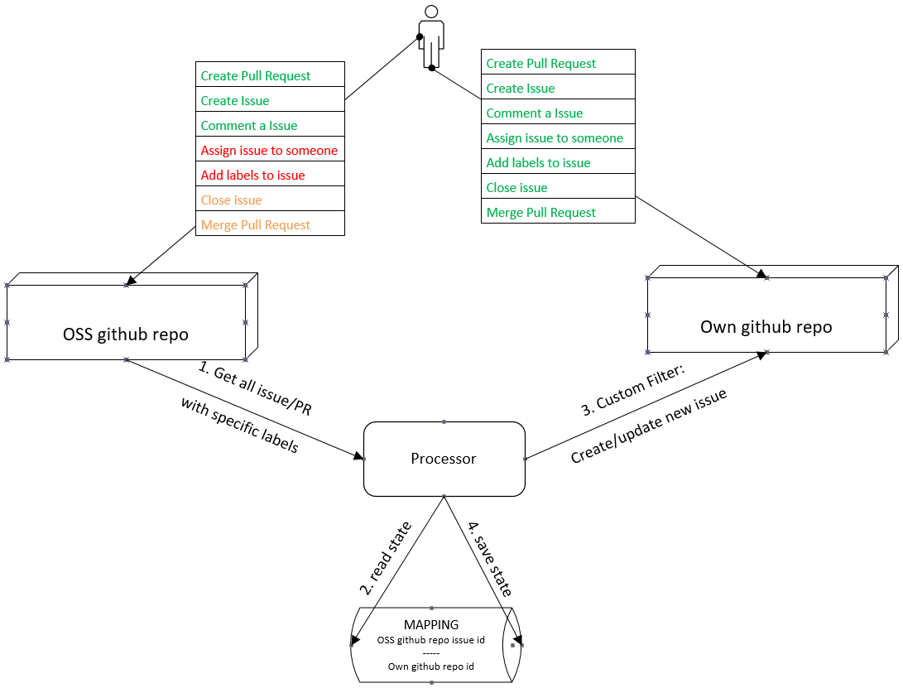

# oss-issue-tracker
This project can set up a service to sync issues and pull-requests with specified labels in a github repo, to a target repo's issue. Also you can write the filter to let the process to filter all the issues and pull-requests and add labels to your new created issues in the target repo.

## Problems you may meet when contributing to OSS project
* You have no write access for the repo.
* You can get all the information by receiving hundreds of notifications, you cannot mark the notification once it read.
* You need to handle many issues and prs, but you cannot add labels to them or assign them to yourself.

## OSS issue tracker can help you
* Tracker gets all the open issues/prs with a specified label.
* With a custom filter, tracker can create a new issue to your own repo with labels.
* You can find the original issue/pr from the new created issue since it links back.
* You can do everything(edit labels/add to project/add milestone/assign to your team member) for the new created issue and make it easy to track.
* Tracker auto closes the new created issue once the original issue/pr is closed. 



## Setup
* `config.json`
    * observer - Open Source repo where you want to sync from.
    * dataStore - You must specify a github file to save state for tracker.
    * monitor - Your own repo where the tracker can create issues.
    * credential_name - You should export an environment variable with the credential name, whose value is the github token, which the tracker can use to operate with github.

    You can see the example below:

    ```json
    {
        "observer": {
            "repo": "https://github.com/ansible/Ansible",
            "labels": ["azure"],
            "credential_name": "github_token"
        },
        "dataStore": {
            "repo": "https://github.com/VSChina/ansible-issue-tracker",
            "branch": "state",
            "filePath": "issue-state.json",
            "credential_name": "github_token"
        },
        "monitor": {
            "repo": "https://github.com/VSChina/ansible-issue-tracker",
            "credential_name": "github_token"
        }
    }
    ```

* `src/filter.js` - implement function `filter(id, item, observer, monitor)` to define your custom filter.

    ```js
    /**
     * your custom filter function.
     * @param id        The issue/pr id in the source repo
     * @param item      The tracker item
     *                      - issueId          The same with id
     *                      - projectId        Issue id in your own repo    
     *                      - title            Title of the issue/pr in the source repo
     *                      - rawUrl           Html Url of the issue/pr in the source repo
     *                      - comment          Comment you will made in your new created item
     *                      - labels []        Labels you get this time from the source repo
     *                      - storedLabels []  Labels you get last time from the source repo
     *                      - assign           Which team member you will assign
     * @param observer  Which implement some interface to get information from source repo
     * @param monitor   Which implement some interface to get/set information with your own repo
     */
    async await filter(id, item, observer, monitor);
    ```